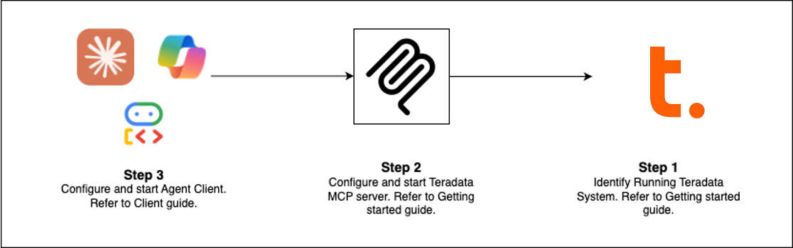

<p align="center">
  <h1>Teradata MCP Server</h1>
  
  <a href="https://github.com/Teradata/teradata-mcp-server/blob/main/docs/README.md">
    
  </a>
  <a href="https://github.com/Teradata/teradata-mcp-server/releases">
    
  </a>
  <a href="https://pypi.org/project/teradata-mcp-server/">
    
  </a>
  <a href="https://pypi.org/project/teradata-mcp-server/">
    
  </a>

  <p>Connect AI agents directly to Teradata with enterprise security and extensibility.</p>
</p>



## Quick Start (Choose Your Path)

| **Client** | **Best For** | **Setup Time** |
|---|---|---|
| [Claude Desktop](docs/server_guide/QUICK_START.md) | Exploratory analysis, platform admin | 5 min |
| [VS Code + Copilot](docs/server_guide/QUICK_START_VSCODE.md) | Data engineering, agent development | 5 min |
| [Open WebUI](docs/server_guide/QUICK_START_OPEN_WEBUI.md) | Testing new LLMs locally | 5 min |
| [Code Examples](examples/README.md#client-applications) | Build your own client | varies |
| [Flowise](docs/client_guide/Flowise_with_teradata_mcp_Guide.md) | Visual agent builder | 10 min |

**Pre-requisites:** [Teradata database](https://www.teradata.com/getting-started/demos/clearscape-analytics) (or free sandbox) + [uv](https://docs.astral.sh/uv/getting-started/installation/)

### Claude Desktop Setup (No Installation)

Add this to `claude_desktop_config.json` (Settings > Developer > Edit Config):

```json
{
  "mcpServers": {
    "teradata": {
      "command": "uvx",
      "args": ["teradata-mcp-server"],
      "env": {
        "DATABASE_URI": "teradata://<USERNAME>:<PASSWORD>@<HOST_URL>:1025/<USERNAME>"
      }
    }
  }
}
```

## What You Can Do

| **Use Case** | **Capabilities** | **Tools** |
|---|---|---|
| **Query & Analyze** | Explore tables, profile data, explain results, visualize patterns—no SQL needed | [base](src/teradata_mcp_server/tools/base/README.md), [dba](src/teradata_mcp_server/tools/dba/README.md), [qlty](src/teradata_mcp_server/tools/qlty/README.md), [plot](src/teradata_mcp_server/tools/plot/README.md) |
| **AI & RAG Pipelines** | Semantic search, retrieval-augmented generation, vector storage | [rag](src/teradata_mcp_server/tools/rag/README.md), [tdvs](src/teradata_mcp_server/tools/tdvs/README.md), [fs](src/teradata_mcp_server/tools/fs/README.md) |
| **Database Admin** | Manage security, monitor capacity, automate backups | [dba](src/teradata_mcp_server/tools/dba/README.md), [sec](src/teradata_mcp_server/tools/sec/README.md), [bar](src/teradata_mcp_server/tools/bar/README.md) |

| **Custom Logic** | Define domain tools, metrics, and semantic layers in YAML | Customization (no code required) |

## What's New (Latest Release)

- **FastMCP v3** — Guaranteed resource cleanup with improved lifespan management
- **Hooks Capability** — Intercept tool calls for custom monitoring, audit, or rate-limiting
- **Row Limit Protection** — Configurable caps (`DEFAULT_ROW_LIMIT`, `MAX_ROW_LIMIT`) prevent LLM token overflow
- **Enhanced Security** — VX views for fine-grained row-level access control

## Extend & Deploy

**Add Custom Logic**  
Use hooks to intercept tool calls for monitoring, audit trails, or validation → [Hooks Guide](docs/developer_guide/HOOKS.md)

**Define Semantic Layers**  
Create domain-specific tools, prompts, and cubes in YAML → [Customization Guide](docs/server_guide/CUSTOMIZING.md)

**Deploy Everywhere**  
Run as CLI (uv), HTTP server, Docker container, or cloud service → [Installation Guide](docs/server_guide/INSTALLATION.md)

## See It In Action

- [Voice Agent](examples/app-voice-agent/) — Real-time bidirectional audio with Amazon Nova Sonic
- [Web Agent](examples/app-adk-agent/) — Interactive chat UI with Google ADK framework
- [Flowise Builder](examples/app-flowise/) — Visual drag-and-drop workflows
- [Custom Middleware](examples/server-customisation/server-hooks/) — Performance monitoring patterns

## Learn More

- [Full Documentation](docs/README.md) — Installation, configuration, architecture, security
- [Video Tutorials](docs/server_guide/VIDEO_LIBRARY.md) — Step-by-step walkthroughs
- [Developer Guide](docs/developer_guide/DEVELOPER_GUIDE.md) — Extend and contribute
- [Architecture](docs/server_guide/ARCHITECTURE.md) — How components work together

## Contributing

We welcome contributions! See our [Contributing Guide](docs/developer_guide/CONTRIBUTING.md) and [Developer Guide](docs/developer_guide/DEVELOPER_GUIDE.md) to get started.
