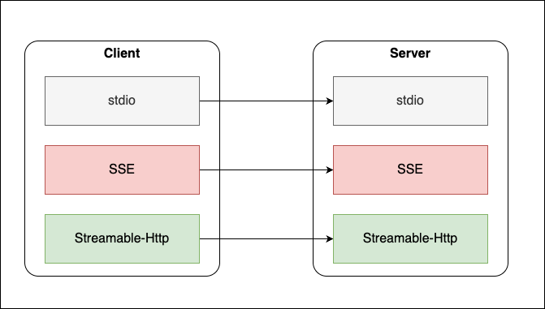

# Working with MCP Clients

> **📍 Navigation:** [Documentation Home](../README.md) | [Server Guide](../README.md#-server-guide) | [Getting started](../server_guide/GETTING_STARTED.md) | [Architecture](../server_guide/ARCHITECTURE.md) | [Installation](../server_guide/INSTALLATION.md) | [Configuration](../server_guide/CONFIGURATION.md) | [Security](../server_guide/SECURITY.md) | [Customization](../server_guide/CUSTOMIZING.md) | [<u>**Client Guide**</u>](CLIENT_GUIDE.md) 


This documet will cover the process and options for getting a client tool to connect to the teradata-mcp-server.  Note that you have many client options, we will cover some but not all.

The transport mode that the server is running needs to be the same as the client configuration.



If you configured the server as a Streamable-http transport mode then the client also needs to be configured as a streamable-http mode.

There are many client options that you can choose from, they each have different strengths, we have curated a small number so that you have examples.

## GUI Clients

- [Claude Desktop](./Claude_desktop.md)
- [Microsoft Copilot](./Microsoft_copilot.md)
- [Google AgentSpace](./Google_agentspace.md)
- [Open WebUI](./Open_WebUI.md)
- [Uderia Platform](https://uderia.com) 
- [Perplexity Desktop](Perplexity%20Desktop.md)

## Audio Client
- [MCP Voice Client](../../examples/MCP_VoiceClient/README.md)

## Code Clients
- [Visual Studio Code](./Visual_Studio_Code.md)
- [MCP Inspector](./MCP_Inspector.md) - For testing MCP server
- [Google ADK Client](../../examples/Simple_Agent/README.md)
- [mcp client framework](../../examples/MCP_Client_Example/README.md)
- [REST API](./Rest_API.md)
- [Google Gemini CLI](./Google_Gemini_CLI.md)


---------------------------------------------------------------------

## Row caps and the `get_all` escape hatch

Tools that return result sets are capped server-side before rows reach the LLM. Defaults are 1000 rows with a 50000 hard ceiling, both configurable on the server (`DEFAULT_ROW_LIMIT`, `MAX_ROW_LIMIT`). Most clients do not need to do anything — the cap is transparent.

Two things are worth knowing when integrating a client:

**1. Every capped tool exposes a `get_all` parameter.** Set `get_all=true` on a single call to raise the cap to the per-tool ceiling. Use it sparingly — the ceiling exists to protect the context window. Tools that opt out of the cap (single-row results, DDL, plans, charts) do not advertise `get_all`.

**2. Truncated responses include a `metadata.truncation` block.** When a result is trimmed, the response payload looks like:

```json
{
  "results": [ ... ],
  "metadata": {
    "tool_name": "base_columnDescription",
    "truncation": {
      "truncated": true,
      "rows_returned": 1000,
      "row_limit": 1000,
      "hard_ceiling": 50000,
      "get_all_used": false,
      "hint": "Result truncated. Refine using parameters [table_name, column_name] to narrow the result, or pass get_all=true to raise the limit to 50000 rows."
    }
  }
}
```

The `hint` is generated server-side and already names the parameters worth narrowing on (or, for `base_readQuery`, suggests adding `TOP`/`SAMPLE`/`WHERE` to the SQL). Client agents should surface this hint to the LLM so it can either ask the user a narrowing question or retry with `get_all=true`. When `get_all=true` was already used and the ceiling was hit, the hint instructs the LLM to refine further or use `persist=true` and query the volatile table directly.


---------------------------------------------------------------------

