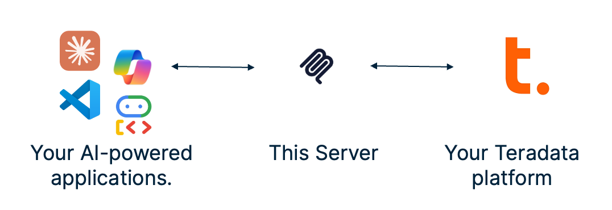
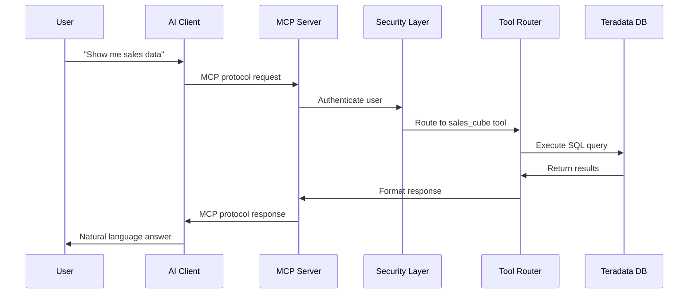

# Architecture Overview

> **📍 Navigation:** [Documentation Home](../README.md) | [Server Guide](../README.md#-server-guide) | **Architecture** | [Quick Start](QUICK_START.md) | [Installation](INSTALLATION.md)

> **🎯 Goal:** Understand how Teradata MCP Server components work together



## 🏗 The Big Picture

The Teradata MCP Server creates a bridge between AI clients and your Teradata platform:

```
[AI Client] ←→ [MCP Server] ←→ [Teradata Platform]
     ↓              ↓                ↓
 Claude Desktop  Tool Router    Database + Analytics
 VS Code         Security        Feature Store
 Google Gemini   Profiles        Vector Store  
 Web Clients     Custom Logic    Data Quality
```

## 🔧 Core Components

### 1. **MCP Server**
- **Role**: Protocol translator and request router
- **What it does**: 
  - Receives requests from AI clients via MCP protocol
  - Translates requests into database operations
  - Routes to appropriate Teradata services
  - Returns formatted responses

### 2. **Tool System**
- **Role**: Business logic and database operations
- **Categories**:
  - **Base Tools**: SQL queries, schema exploration, data reading
  - **Analytics Tools**: Feature Store, Vector Store, Data Quality
  - **Admin Tools**: DBA operations, security management
  - **Custom Tools**: Your business-specific logic

### 3. **Security Layer**
- **Authentication**: Validate user identity
- **Authorization**: Database RBAC enforcement  
- **Audit**: Query banding and logging
- **Rate Limiting**: Prevent abuse

### 4. **Configuration System**
- **Profiles**: Control which tools are available
- **Custom Objects**: YAML-defined tools, prompts, cubes
- **Environment**: Database connections and server settings

## 🚦 Request Flow

### Typical User Interaction



### What Happens Behind the Scenes

1. **Request Reception**: MCP Server receives structured request
2. **Authentication**: Validates user credentials (if enabled)
3. **Tool Selection**: Routes to appropriate tool based on request
4. **Query Construction**: Builds optimized SQL from parameters
5. **Database Execution**: Executes on Teradata with query banding
6. **Response Formatting**: Structures results for AI consumption
7. **Security Logging**: Records operation for audit

## 🎭 Deployment Patterns

### Pattern 1: Desktop Development
```
[Claude Desktop] ←stdio→ [MCP Server Process] ←→ [Teradata Dev DB]
```
- **Use case**: Individual data analysis, development
- **Transport**: stdio (most efficient)
- **Security**: Server credentials
- **Scaling**: Single user

### Pattern 2: Team HTTP Service  
```
[Multiple Clients] ←HTTP→ [MCP Server Container] ←→ [Teradata Prod DB]
```
- **Use case**: Team collaboration, web applications
- **Transport**: streamable-http
- **Security**: Basic auth with user credentials  
- **Scaling**: Multiple concurrent users

### Pattern 3: Enterprise Integration
```
[Enterprise Apps] ←REST API→ [Load Balancer] ←→ [MCP Server Cluster] ←→ [Teradata Enterprise]
```
- **Use case**: Production applications, high availability
- **Transport**: streamable-http with orchestration
- **Security**: Full authentication + RBAC
- **Scaling**: Horizontal with load balancing

## 🔌 Integration Points

### With Teradata Platform

- **Core Database**: SQL operations, stored procedures
- **Feature Store**: ML feature management and serving
- **Vector Store**: Semantic search and similarity
- **Query Grid**: Distributed query processing
- **DBQL**: Query logging and performance monitoring

### With AI Clients

- **Protocol**: MCP (Model Context Protocol) standard
- **Transport**: stdio, HTTP, Server-Sent Events
- **Format**: JSON-RPC with typed schemas
- **Discovery**: Dynamic tool and resource discovery

### With External Systems

- **Authentication**: LDAP, Active Directory, OAuth
- **Monitoring**: Prometheus metrics, custom logging
- **Configuration**: Environment variables, YAML files
- **Storage**: Custom object definitions, profiles

## 🛡 Security Architecture

### Authentication Flow
```
User Request → Rate Limiting → Token Validation → Database Auth → Tool Execution
```

### Authorization Layers
1. **MCP Level**: Which tools user can access
2. **Database Level**: Teradata RBAC and row-level security  
3. **Tool Level**: Parameter validation and sanitization
4. **Query Level**: Query banding and resource limits

## 🚀 Scalability Considerations

### Vertical Scaling
- **Connection Pooling**: Reuse database connections efficiently
- **Caching**: Cache schema information and frequent queries
- **Resource Limits**: Control memory and CPU usage per request

### Horizontal Scaling  
- **Stateless Design**: Each server instance is independent
- **Load Balancing**: Distribute requests across instances
- **Database Scaling**: Leverage Teradata's distributed architecture

## 🎯 Customization Architecture

### Extension Points
1. **Custom Tools**: Python functions for business logic
2. **YAML Objects**: Declarative tools, prompts, and cubes
3. **Profiles**: Control tool availability per environment
4. **Middleware**: Request/response transformation

### Development Workflow
```
Write Code/YAML → Test Locally → Deploy Configuration → Monitor Usage
```

## ✨ Getting Started Paths

Now that you understand the architecture, choose your path:

### 🚀 **Want to try it immediately?**
→ [5-Minute Quick Start](QUICK_START.md)
- Get running with Claude Desktop in 5 minutes
- Perfect for evaluation and learning

### 🏗 **Setting up for your team?**  
→ [Installation Guide](INSTALLATION.md)
- Compare deployment options
- Production-ready configurations
- Docker and enterprise setups

### 🔒 **Need enterprise security?**
→ [Security Configuration](SECURITY.md)  
- Authentication and authorization
- Audit logging and compliance
- Production security patterns

### 🛠 **Want to customize for your business?**
→ [Customization Guide](CUSTOMIZING.md)
- Add domain-specific tools
- Create semantic layers
- Business logic integration

### 👥 **Ready to connect clients?**
→ [Client Guide](../client_guide/CLIENT_GUIDE.md)
- AI client configurations
- Desktop and web integrations
- API usage patterns

---
*This overview covers the conceptual architecture. For hands-on implementation, start with the [Quick Start Guide](QUICK_START.md).*