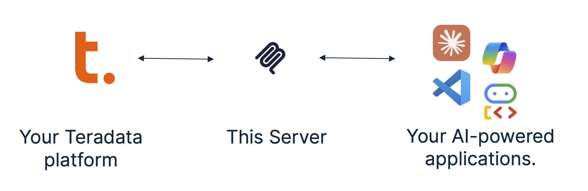

# Architecture Overview

> **📍 Navigation:** [Documentation Home](../README.md) | [Server Guide](../README.md#-server-guide) | **Architecture** | [Quick Start](QUICK_START.md) | [Installation](INSTALLATION.md)

> **🎯 Goal:** Understand how Teradata MCP Server components work together



## 🏗 The Big Picture

The Teradata MCP Server creates a bridge between AI clients and your Teradata platform:

```
[AI Client] ←→ [MCP Server] ←→ [Teradata Platform]
     ↓              ↓                ↓
 Claude Desktop  Toolkit        Analytic Engine
 VS Code         Security          Metadata
 Google Gemini   Profiles         Database  
 Web Clients     Custom Logic   Vector Store
```

## 🔧 Core Components

### 1. **MCP Server**
- **Role**: Protocol translator and request router
- **What it does**: 
  - Receives requests from AI clients via MCP protocol
  - Translates requests into database operations
  - Routes to appropriate Teradata services
  - Returns formatted responses

### 2. **Tool System**
- **Role**: Business logic and database operations
- **Categories**:
  - **Base Tools**: SQL queries, schema exploration, data reading
  - **Analytics Tools**: Feature Store, Vector Store, Data Quality
  - **Admin Tools**: DBA operations, security management
  - **Custom Tools**: Your business-specific logic

### 3. **Security Layer**
- **Authentication**: Validate user identity
- **Authorization**: Database RBAC enforcement  
- **Audit**: Query banding and logging
- **Rate Limiting**: Prevent abuse

### 4. **Configuration System**
- **Profiles**: Control which tools are available
- **Custom Objects**: YAML-defined tools, prompts, cubes
- **Environment**: Database connections and server settings

## 🚦 Request Flow

### Typical User Interaction


### What Happens Behind the Scenes

1. **Request Reception**: MCP Server receives structured request
2. **Authentication**: Validates user credentials (if enabled)
3. **Tool Selection**: Routes to appropriate tool based on request
4. **Query Construction**: Builds optimized SQL from parameters
5. **Database Execution**: Executes on Teradata with query banding
6. **Response Formatting**: Structures results for AI consumption
7. **Security Logging**: Records operation for audit

## 🎭 Deployment Patterns

### Pattern 1: Bundled with application

Eg. 

```
[Claude Desktop] ←stdio|http→ [MCP Server Process] ←→ [Teradata]
```
- **Use case**: Individual data analysis, application with dedicated MCP server instance.
- **Transport**: stdio if server co-located with application or http
- **Security**: One database user for the application, configured at the server level.
- **Scaling**: Single server process, configurable database connection pool

### Pattern 2: Shared Server
```
[Multiple Clients] ←http→ [MCP Server] ←→ [Teradata]
```
- **Use case**: Shared MCP server for multiple applications
- **Transport**: streamable-http
- **Security**: One database user per application, configured at the application level, database service account for the MCP server. User identity validated by MCP server using database authentication method, RBAC policies applied to application database user.
- **Scaling**: Single server process, configurable database connection pool

### Pattern 3: Enterprise Integration
```
[Enterprise Apps] ←http→ [Load Balancer] ←→ [MCP Server Contianers] ←→ [Teradata ]
```
- **Use case**: Large end-user base, high variety of applications
- **Transport**: streamable-http 
- **Security**: One database user per end-user, configured at the end-user level, database service account for the MCP server. User identity validated by MCP server using IDP, RBAC policies applied to application database user.
- **Scaling**: Horizontal with container orchestration and load balancing

## 🛡 Security Architecture

### Request Flow
```
User Request → Rate Limiting → [Database Auth] → Tool Execution -> Database RBAC
```

### Security Layers
1. **MCP Level**: Control tool availability, user authentication using database
2. **Database Level**: Teradata RBAC and row-level security  
3. **Tool Level**: Parameter validation and sanitization

## 🎯 Customization Architecture

### Extension Points
1. **Custom Tools**: Python functions for business logic
2. **YAML Objects**: Declarative tools, prompts, and cubes
3. **Profiles**: Control tool availability per environment
4. **Middleware**: Request/response transformation

## ✨ Getting Started Paths

Now that you understand the architecture, choose your path:

### 🚀 **Want to try it immediately?**
→ [5-Minute Quick Start](QUICK_START.md)
- Get running with Claude Desktop in 5 minutes
- Perfect for evaluation and learning

### 🏗 **Setting up for your team?**  
→ [Installation Guide](INSTALLATION.md)
- Compare deployment options
- Production-ready configurations
- Docker and enterprise setups

### 🔒 **Need enterprise security?**
→ [Security Configuration](SECURITY.md)  
- Authentication and authorization
- Audit logging and compliance
- Production security patterns

### 🛠 **Want to customize for your business?**
→ [Customization Guide](CUSTOMIZING.md)
- Add domain-specific tools
- Create semantic layers
- Business logic integration

### 👥 **Ready to connect clients?**
→ [Client Guide](../client_guide/CLIENT_GUIDE.md)
- AI client configurations
- Desktop and web integrations
- API usage patterns

---
*This overview covers the conceptual architecture. For hands-on implementation, start with the [Quick Start Guide](QUICK_START.md).*