# BAR (Backup and Restore) Tools

## DSA (Data Stream Architecture) Design

```mermaid
flowchart TB
    %% AI Agent Layer (Top)
    subgraph AI_Layer ["🤖 AI Agent Layer"]
        direction LR
        User[👤 User Input] --> LLM[🤖 AI Agent/LLM] --> Output[📄 Output]
    end
    
    %% Integration Layer
    subgraph Integration_Layer ["🔌 Integration Layer"]
        direction LR
        MCP[🔌 MCP Server<br/>BAR Tools] --> API[🌐 DSA REST API]
    end
    
    %% Infrastructure Layer
    subgraph DSA_Infrastructure ["🏢 DSA Infrastructure"]
        direction LR
        DSC[🎛️ DSC] -.-> DSMain[📊 DSMain]
        DSC -.-> BarNC[📦 BarNC]
        DB[(🗄️ Teradata<br/>Database)] <-->|read/write| DSMain
        DSMain <-->|data stream| BarNC
    end
    
    %% Storage Layer
    subgraph Storage_Solutions ["💾 Storage Solutions"]
        direction LR
        Storage{Backup Storage} --> Disk[📁 Disk]
        Storage --> S3[☁️ S3]
        Storage --> Azure[🔷 Azure]
        Storage --> GCS[🌐 GCS]
        Storage --> NetBackup[🔒 NetBackup]
        Storage --> Spectrum[🎯 Spectrum]
    end
    
    %% Vertical Flow Between Layers
    LLM -.-> MCP
    API --> DSC
    BarNC <-->|Backup: write<br/>Restore: read| Storage
    
    %% Styling
    classDef userStyle fill:#e3f2fd,stroke:#1976d2,stroke-width:2px
    classDef integrationStyle fill:#f3e5f5,stroke:#7b1fa2,stroke-width:2px
    classDef infraStyle fill:#fff3e0,stroke:#f57c00,stroke-width:2px
    classDef storageStyle fill:#e8f5e8,stroke:#388e3c,stroke-width:2px
    
    class User,LLM,Output userStyle
    class MCP,API integrationStyle
    class DSC,DSMain,BarNC,DB infraStyle
    class Storage,Disk,S3,Azure,GCS,NetBackup,Spectrum storageStyle
```



## Prerequisites

**DSA Infrastructure** must be properly configured and running before using BAR tools

### Environment Variables
The BAR tools require the following environment variables for DSA connection:

- `DSA_BASE_URL` - Base URL for DSA API (default: https://localhost:9090/)
- `DSA_USERNAME` - Username for DSA authentication (default: admin)
- `DSA_PASSWORD` - Password for DSA authentication (default: admin)
- `DSA_VERIFY_SSL` - Whether to verify SSL certificates (default: true)
- `DSA_CONNECTION_TIMEOUT` - Request timeout in seconds (default: 30)

### BAR Profile Configuration
The BAR profile is defined in `config/profiles.yml` and controls access to BAR-related tools and resources.

**Profile Configuration:**
```yaml
bar:
  tool:
    - ^bar_*          # All BAR tools (bar_manageDsaDiskFileSystem, etc.)
    - ^base_readQuery$  # Read-only database queries
    - ^base_databaseList$  # Database listing
  prompt:
    - ^bar_*          # BAR-specific prompts
  resource:
    - ^bar_*          # BAR-specific resources
```

**What the BAR profile enables:**
- Access to all `bar_*` tools for backup and restore operations
- Basic database read operations for backup source identification
- Database listing capabilities for backup planning
- BAR-specific prompts and resources

**Usage:** Specify `--profile bar` when running MCP server to enable BAR-specific functionality.


## Available Tools

**Total Estimated Tools: 16** (1 ✅ Developed, 15 🚧 Planned)

### Storage Configuration Tools

#### bar_manageDsaDiskFileSystem ✅
**Status**: Developed
Unified tool for managing DSA disk file system configurations for backup storage.

#### bar_manageAwsS3 🚧
**Status**: Planned
Tool for managing AWS S3 bucket configurations for backup storage.

#### bar_manageAzureBlob 🚧
**Status**: Planned
Tool for managing Azure Blob Storage configurations for backup storage.

#### bar_manageGoogleCloud 🚧
**Status**: Planned
Tool for managing Google Cloud Storage configurations for backup storage.

#### bar_manageNetBackup 🚧
**Status**: Planned
Tool for managing NetBackup configurations for enterprise backup storage.

#### bar_manageIbmSpectrum 🚧
**Status**: Planned
Tool for managing IBM Spectrum Protect configurations for backup storage.

### Infrastructure Management Tools

#### bar_manageMediaServer 🚧
**Status**: Planned
Tool for managing BarNC configurations

#### bar_manageTeradataSystem 🚧
**Status**: Planned
Tool for managing DSMain configurations and Teradata system integration.

### Target Group Management Tools

#### bar_manageDiskFileTargetGroup 🚧
**Status**: Planned
Tool for managing media server configurations with disk file storage solutions.

#### bar_manageAwsS3TargetGroup 🚧
**Status**: Planned
Tool for managing media server configurations with AWS S3 storage solutions.

#### bar_manageAzureBlobTargetGroup 🚧
**Status**: Planned
Tool for managing media server configurations with Azure Blob storage solutions.

#### bar_manageGoogleCloudTargetGroup 🚧
**Status**: Planned
Tool for managing media server configurations with Google Cloud storage solutions.

#### bar_manageNetBackupTargetGroup 🚧
**Status**: Planned
Tool for managing media server configurations with NetBackup storage solutions.

#### bar_manageIbmSpectrumTargetGroup 🚧
**Status**: Planned
Tool for managing media server configurations with IBM Spectrum storage solutions.

### Operations Management Tools

#### bar_manageJob 🚧
**Status**: Planned
Tool for managing backup and restore job lifecycle.

#### bar_manageSaveSets 🚧
**Status**: Planned
Tool for managing backup files/objects (save sets) created by backup operations.
