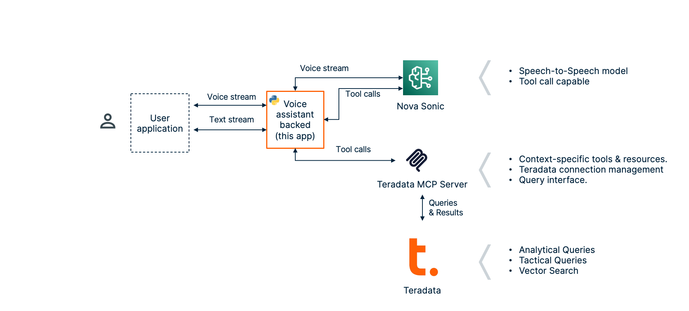

# Voice Assistant with the Teradata MCP server

This tool implements a voice assistant using Amazon Nova Sonic to interact with your Teradata system via the Teradata MCP server. This code is largely inspired from the [Amazon Nova Sonic Python Streaming Implementation](https://github.com/aws-samples/amazon-nova-samples/tree/main/speech-to-speech/sample-codes/console-python) repository.

## Features

- Real-time audio streaming from your microphone to AWS Bedrock
- Bidirectional communication with Nova Sonic model
- Audio playback of Nova Sonic responses
- Simple console-based interface showing transcripts
- Support for debug mode with verbose logging
- Barge-in capability (in nova_sonic.py and nova_sonic_tool_use.py)
- Tool use via integration with the Teradata MCP server

## Prerequisites

- Python 3.12
- AWS Account with Bedrock access
- AWS CLI configured with appropriate credentials
- Working microphone and speakers
- Teradata MCP server and Teradata system.

## Installation

1. Create and activate a virtual environment:

First, navigate to the root folder of the project and create a virtual environment:

```bash
# Create a virtual environment
python -m venv .venv

# Activate the virtual environment
# On macOS/Linux:
source .venv/bin/activate
# On Windows:
# .venv\Scripts\activate
```

2. Install all dependencies:

With the virtual environment activated, install the required packages:

```bash
python -m pip install -r requirements.txt --force-reinstall
```

2. Configure AWS credentials:

The application uses environment variables for AWS authentication. Set these before running the application:

```bash
export AWS_ACCESS_KEY_ID="your-access-key"
export AWS_SECRET_ACCESS_KEY="your-secret-key"
export AWS_DEFAULT_REGION="us-east-1"
```

## Usage

Run run the Teradata MCP server with Streamable HTTP (this demo currently expects the server on `http://0.0.0.0:8001`):

```
uv run teradata-mcp-server --mcp_transport streamable-http --mcp_port 8001
```

Run the script in standard mode:

```bash
python mcp_voice_client.py
```

Or with debug mode for verbose logging:

```bash
python mcp_voice_client.py --debug
```

### How it works



1. When you run the script, it will:
   - Connect to AWS Bedrock
   - Connect to the Teradata MCP server
   - Initialize two streaming sessions towards Bedrock and the Teradata MCP server
   - Start capturing audio from your microphone
   - Stream the audio to the Nova Sonic model
   - Issue tool calls to the MCP server as required over HTTP
   - Play back audio responses through your speakers
   - Display transcripts in the console

2. During the conversation:
   - Your speech will be transcribed and shown as "User: [transcript]"
   - The Nova Sonic's responses will be shown as "Assistant: [response]"
   - Audio responses will be played through your speakers

3. To end the conversation:
   - Press Enter at any time
   - The script will properly close the connection and exit


## Customization

You can modify the following parameters in the scripts:

- `SAMPLE_RATE`: Audio sample rate (default: 16000 Hz for input, 24000 Hz for output)
- `CHANNELS`: Number of audio channels (default: 1)
- `CHUNK_SIZE`: Audio buffer size (varies by implementation)

You can also customize the system prompt by modifying the `default_system_prompt` variable in the `initialize_stream` method.

## Troubleshooting

1. **Audio Input Issues**
   - Ensure your microphone is properly connected and selected as the default input device
   - Try increasing the chunk size if you experience audio stuttering
   - If you encounter issues with PyAudio installation:

      **On macOS:**
      ```bash
      brew install portaudio
      ```

      **On Ubuntu/Debian:**

      ```bash
      sudo apt-get install portaudio19-dev
      ```

      **On Windows:** 

      ```bash
      # Install PyAudio binary directly using pip
      pip install pipwin
      pipwin install pyaudio
      ```

      Alternatively, Windows users can download pre-compiled PyAudio wheels from:
      https://www.lfd.uci.edu/~gohlke/pythonlibs/#pyaudio
      ```bash
      # Example for Python 3.12, 64-bit Windows
      pip install PyAudio‑0.2.11‑cp312‑cp312‑win_amd64.whl
      ```

2. **Audio Output Issues**
   - Verify your speakers are working and not muted
   - Check that the audio output device is properly selected

3. **AWS Connection Issues**
   - Verify your AWS credentials are correctly configured as environment variables
   - Ensure you have access to the AWS Bedrock service
   - Check your internet connection

4. **Debug Mode**
   - Run with the `--debug` flag to see detailed logs
   - This can help identify issues with the connection or audio processing


## Known Limitation
> **Warning:** Use a headset for testing, as a known issue with PyAudio affects its handling of echo. You may experience unexpected interruptions if running the samples with open speakers.